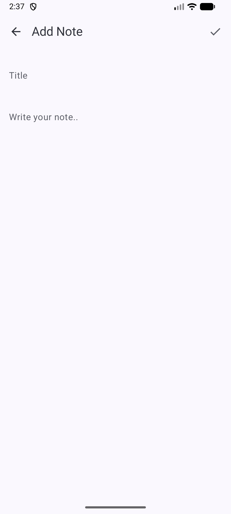

# QuickNotesPlus

QuickNotesPlus is a Jetpack Compose-based notes app built with **MVVM + Clean Architecture**.
It allows users to add, edit, and delete notes with a modern, reactive UI.

---

## Features

- Add, edit, and delete notes
- Staggered grid layout for notes
- Empty state message when no notes are available
- Offline storage using Room Database
- Reactive UI updates using Kotlin Flow
- Date and time display for each note
- Clean Architecture implementation with Mapper class

---

## Screens

1. **Notes List Screen**
   - Displays all notes in a staggered grid
   - Shows empty message if there are no notes
   - Delete notes directly via a delete icon

2. **Add/Edit Note Screen**
   - Add a new note or edit an existing note
   - Save changes and automatically return to the list

---

## Architecture

This project follows **MVVM + Clean Architecture** principles:

- **ViewModel**: Handles UI state and business logic
- **Repository / UseCases**: Handles data operations
- **Room DAO**: Local database for notes
- **Mapper**: Converts **data-layer entities** (`NoteEntity`) to **domain-layer models** (`Note`)
  Ensures the UI and business logic are decoupled from database implementation
- **Flow**: Reactive state updates ensure the UI automatically updates when data changes

---

## Tech Stack

- Kotlin
- Jetpack Compose
- Room Database
- Hilt for Dependency Injection
- Coroutines & Flow

---

## Screenshots

### Notes List Screen
Shows all notes in a staggered grid with empty state message when no notes exist.


---

### Add/Edit Note Screen
Allows adding a new note or editing an existing one. Save notes with the check icon in the top bar.



---

## How to Run

1. Clone the repository:

```bash
git clone https://github.com/yourusername/QuickNotesPlus.git
